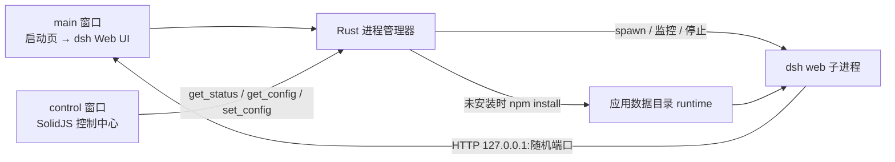

# DSH Desktop

> 用 Tauri 2 为 [DeepSeek Harness](https://github.com/deepseek-ai/deepseek-harness)
> （`dsh`）打造的跨平台桌面套壳：自动拉起 `dsh web`，未安装时一键安装，
> 就绪后直接在系统 WebView 中进入 Harness Web UI。

<p align="center">
  
  
  
  
  
  
</p>

<p align="center">
  
  
</p>

## 特性

- 自动检测 `dsh`：已安装直接启动，未安装提供一键安装并自动进入
- 自动选择空闲 loopback 端口，以 `dsh web --host 127.0.0.1 --port <port>` 启动
- 双窗口架构：main 窗口承载启动页与 dsh Web UI；control 窗口（SolidJS 控制中心）按需打开（菜单项 / `CmdOrCtrl+Shift+C`）

## 架构



## 快速开始

### 前置依赖

| 依赖 | 最低版本 | 用途 |
| --- | --- | --- |
| Node.js | 22 | 前端构建与 dsh 运行环境 |
| Rust | 1.77 | Tauri 后端编译 |
| Yarn | 4 | 依赖管理 |
| `dsh` | 任意 | DeepSeek Harness CLI（可自动安装） |

### 安装

```sh
git clone <your-repo-url> dsh-desktop
cd dsh-desktop
yarn
```

### 开发运行

```sh
yarn dev
```

仅前端热更新：`yarn dev:web`（shell @ :5173，control-center @ :5174）。
类型检查（全部 workspace）：`yarn typecheck`。

### 打包

```sh
yarn build
```

构建产物位于 `apps/shell/src-tauri/target/release/bundle/`：

| 平台 | 产物 |
| --- | --- |
| macOS | `.dmg` |
| Windows | `.exe` |
| Linux | `.AppImage` / `.deb` |

## 一键安装 dsh

启动页检测到系统没有 `dsh` 时，点击“一键安装 DSH”，应用会在数据目录执行：

```sh
npm install --prefix <应用数据目录>/runtime @deepseek-ai/dsh
```

安装日志实时展示在启动页，完成后自动拉起 `dsh web` 并进入界面。

## 多窗口

- **main 窗口**：启动页 → dsh Web UI，负责检测 / 安装 / 拉起 / 监控 dsh（详见 `apps/shell/`）
- **control 窗口**：SolidJS 控制中心，包含仪表盘 / 设置 / 工具三个 Tab（详见 `apps/control-center/`）；通过应用菜单“控制中心”或 `CmdOrCtrl+Shift+C` 按需打开，重复调用只聚焦，关闭仅隐藏

## 配置

配置优先级：`config.json`（应用数据目录）→ 环境变量 → PATH 检测。
控制中心“设置”Tab 通过 `get_config` / `set_config` 读写 `config.json`；未在 `config.json` 设置的字段回退到环境变量。

| 环境变量 | 默认值 | 说明 |
| --- | --- | --- |
| `DSH_BIN` | PATH 中的 `dsh` | 指定 dsh 入口 |
| `DSH_NODE` | PATH 中的 `node` | 指定 Node 解释器 |
| `DSH_HOME` | 继承当前环境 | 传给 dsh 的 Harness 数据目录 |

## 目录结构

```text
dsh-desktop/
├── apps/
│   ├── shell/                    # main 窗口
│   │   ├── index.html            # 启动页入口
│   │   ├── src/                  # 启动页前端（Vite + TypeScript）
│   │   └── src-tauri/            # Tauri 2 + Rust 后端
│   │       ├── capabilities/     # IPC 权限
│   │       ├── icons/            # 应用图标
│   │       └── src/              # lib.rs / config.rs / main.rs
│   └── control-center/           # control 窗口（SolidJS SPA，Vite 8）
│       └── src/
│           ├── pages/            # Dashboard / Settings / Tools
│           └── lib/ipc.ts        # 全部 Tauri 调用与事件监听
├── packages/
│   └── contracts/                # 共享 IPC 类型与常量（@dsh-desktop/contracts）
├── .github/
│   ├── scripts/                  # 版本管理脚本
│   └── workflows/                # 三平台构建与自动发布
├── dist/                         # 前端构建产物（生成，勿手改）
├── CHANGELOG.md
└── package.json
```

## 注意事项

- 构建产物未签名，macOS 首次打开需右键“打开”，Windows 会提示 SmartScreen
- Linux 构建依赖 WebKitGTK 等系统包，GitHub Actions 已内置安装步骤

## 贡献

1. Fork 本仓库并创建功能分支
2. 提交信息遵循 [Conventional Commits](https://www.conventionalcommits.org/)
3. 推送分支并创建 Pull Request
4. 通过三平台构建后合并

## License

[MIT](LICENSE)
