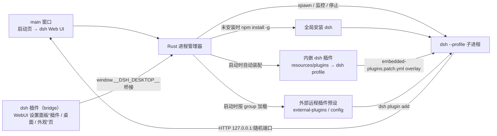

# DSH Desktop

> 用 Tauri 2 为 [DeepSeek Harness](https://github.com/deepseek-ai/deepseek-harness)
> （`dsh`）打造的跨平台桌面套壳：自动拉起 `dsh web`，未安装时一键安装，
> 就绪后直接在系统 WebView 中进入 Harness Web UI。

<p align="center">
  <b>简体中文</b> · <a href="README.en.md">English</a>
</p>

<p align="center">
  
  
  
  
  
  
</p>

<p align="center">
  
  
</p>

## 特性

- 自动检测 `dsh`：已安装直接启动，未安装提供一键安装并自动进入
- 启动时让 dsh 自选空闲 loopback 端口（`dsh --profile <active> --host 127.0.0.1 --port 0`，默认 profile 为 `web`）
- 单窗口架构：main 窗口承载启动页与 dsh Web UI；桌面壳能力（远程插件 / 状态 / 配置 / profile / 界面模式 / 工具 / 开机自启）经 dsh 插件在 WebUI 设置面板的“插件”“桌面”“外观”页提供，不再有独立 control 窗口
- 内嵌 dsh 插件自动装配：`packages/plugins`（bridge 桥接 / projects 项目 / shortcuts 快捷键 / reasoning 模型与思考强度）随应用打包进 Tauri resources，启动时自动复制到 dsh profile 并生成 `--patch` overlay 挂载；另支持从 `packages/external-plugins` 等外部路径按 group 加载固定远程插件预设，启动时自动 `dsh plugin add`
- 原生能力增强：系统托盘（关闭到托盘）、原生通知、单实例锁、崩溃自动重启、系统主题跟随、优雅退出与进程树清理、文件拖放、窗口状态记忆、`dsh-desktop://` 深链、自动更新（后台检查 + “桌面”页“检查更新”）、更新 dsh 本体、开机自启与启动模式（dsh 插件设置面板，默认关闭）、自定义全局快捷键、远程插件预设与受管插件操作、托盘“退出”二次确认；dsh web 受控桥接 `window.__DSH_DESKTOP__`（打开外部链接 / 运行状态与日志 / 配置 / profile / 远程插件 / 开机自启 / 全局快捷键 / 更新 / 更新 dsh 本体）
- profile 与启动模式：启动时使用 active profile，可在“桌面”页切换 profile，并选择 `normal` / `tray` / `minimized` 启动模式
- 界面模式：可在“桌面”页切换 dsh 桌面运行模式（`compatibility` / `advanced`，Linux 固定 `compatibility`，切换后重启生效）
- 主题与背景图：设置 → 外观（内置 7 主题家族浅/深两半、自定义主题、背景图毛玻璃/像素化/玻璃透明度、排版），启动页与窗口背景跟随
- 第三方思考强度：设置 → 模型 的自定义设置里可为自定义 / 第三方模型勾选 `low` / `medium` / `high` / `xhigh` / `max`，输入栏模型菜单可直接切换推理等级
- 无边框窗口 + 自绘标题栏：可拖动、双击最大化，最小化/最大化/关闭按钮齐全，标题栏背景跟随主题
- 局域网访问：内置零依赖反向代理脚本，让局域网设备访问本机 `dsh web`（无鉴权，仅限可信网络）

## 架构



## 快速开始

### 前置依赖

| 依赖 | 最低版本 | 用途 |
| --- | --- | --- |
| Node.js | 22 | 前端构建与 dsh 运行环境 |
| Rust | 1.77 | Tauri 后端编译 |
| Yarn | 4 | 依赖管理 |
| `dsh` | 任意 | DeepSeek Harness CLI（可自动安装） |

### 安装

```sh
git clone https://github.com/NoelOrin/dsh-desktop.git
cd dsh-desktop
corepack yarn install
```

> 若本机尚未启用 Corepack，可先执行 `corepack enable`。

### 开发运行

```sh
yarn dev
```

- `yarn dev`：完整 Tauri 开发模式（先构建插件，再启动 Vite 与插件 watch）
- `yarn dev:web`：仅前端热更新（shell @ :5173）
- `yarn dev:shell`：Tauri `beforeDevCommand` 使用的前置命令：构建插件 + Vite
- `yarn dev:plugins`：仅监听插件源码并热部署到 dsh profile
- `yarn build:web`：构建前端到 `dist/`
- `yarn build:plugins`：编译 dsh 插件到 Tauri resources（自动清理旧产物）
- `yarn tauri`：透传 Tauri CLI 到 shell workspace
- `yarn typecheck` / `yarn lint` / `yarn format:check`：类型检查与代码规范检查
- `yarn lan-proxy`：局域网反向代理（见下文）

### 打包

```sh
yarn build
```

`yarn build` 会先构建前端与内嵌 dsh 插件，再执行 Tauri 打包。构建产物位于 `apps/shell/src-tauri/target/release/bundle/`：

| 平台 | 产物 |
| --- | --- |
| macOS | `.dmg` |
| Windows | `.exe` |
| Linux | `.AppImage` / `.deb` |

macOS DMG 使用自定义安装背景与图标布局，源文件见 `apps/shell/src-tauri/bundle/macos/`。

## 一键安装 dsh

启动页检测到系统没有 `dsh` 时，点击“一键安装 DSH”，应用会直接执行全局安装：

```sh
npm install -g @deepseek-ai/dsh
```

安装日志实时展示在启动页，完成后自动拉起 `dsh`（默认 `web` profile）并进入界面。

## 内嵌 dsh 插件

`packages/plugins` 是本仓库的 dsh 插件容器，当前包含：

- `bridge`（`@dsh-desktop/plugin-bridge`）— 桥接 Tauri 壳能力的双面插件：在 dsh WebUI 设置面板渲染“插件”页（外部固定 + 本地分组远程插件 / 整组同步 / 已安装插件 / 移除 / 更新）、“桌面”页（状态 / 配置 / 运行环境 profile / 界面模式 / 工具 / 开机自启）与“外观”页（主题偏好 / 主题库 / 背景图 / 玻璃透明度 / 自定义主题 / 排版），通过 `window.__DSH_DESKTOP__` 调用壳能力（打开外部链接 / 窗口控制 / 运行状态与日志 / 配置 / profile / 远程插件 / 开机自启 / 全局快捷键 / 更新）
- `bridge`（`@dsh-desktop/plugin-bridge`）— 桥接 Tauri 壳能力的双面插件：在 dsh WebUI 设置面板渲染“插件”页（外部固定 + 本地分组远程插件 / 整组同步 / 已安装插件 / 移除 / 更新）、“桌面”页（状态 / 配置 / 局域网访问 / 运行环境 profile / 界面模式 / 工具 / 开机自启）与“外观”页（主题偏好 / 主题库 / 背景图 / 玻璃透明度 / 自定义主题 / 排版），通过 `window.__DSH_DESKTOP__` 调用壳能力（打开外部链接 / 窗口控制 / 运行状态与日志 / 配置 / 局域网代理 / profile / 远程插件 / 开机自启 / 全局快捷键 / 更新）
- `projects`（`@dsh-desktop/plugin-projects`）— 项目 host 插件：为侧边栏右键菜单提供 dsh 工作区/会话数据与动作端点
- `shortcuts`（`@dsh-desktop/plugin-shortcuts`）— 全局快捷键设置插件：在 dsh WebUI 设置面板管理壳侧全局快捷键，并提供双击 Esc 停止当前对话
- `reasoning`（`@dsh-desktop/plugin-reasoning`）— 模型设置插件：在“模型”页中为自定义 / 第三方模型配置推理等级，写入 `reasoningEfforts` 后输入栏模型菜单可直接切换
- `client-kit`（共享源码，非插件）— 统一 `window.__DSH_DESKTOP__` 读取、client CSS 注入与 tsdown 公共构建插件；构建时内联进各插件的 client bundle，不进入 `resources/plugins`

构建时 `scripts/build-plugins.mjs` 用 tsdown 编译各插件，并把自包含 dist 清单拷贝进 `apps/shell/src-tauri/resources/plugins/`，随安装包分发；插件从源码删除后，下次构建会自动清理 resources 与 `--home` profile 中的旧产物。应用启动时 `embedded.rs` 将其复制到 dsh profile 的 node_modules 并生成 `--patch` overlay，`dsh --profile <active>` 启动即自动挂载，全程 best-effort 不阻塞启动。

### 远程插件预设

远程插件预设分为两类：外部目录中的固定预设（如仓库 `packages/external-plugins`，每个顶层 `*.json` 文件为一个 group，合并结果只读）与 `config.json.remote_plugins` 中的本地分组预设。启动时会对 active profile 执行 `dsh plugin add`，bridge 插件“插件”页支持整组同步、已安装插件列表、移除与更新。

预设可声明 `allow_build` 数组，安装时透传 pnpm `--allow-build`，用于 GitHub/git 插件等需要构建脚本的场景。
构建时 `yarn build:plugins` 会把 `packages/external-plugins/*.json` 装配进 Tauri resources，随发布包分发，默认远程预设会随应用一起生效。

> 插件域与 Tauri 壳域的职责边界、受控桥接与端口白名单机制，见 [docs/plugin-tauri-boundary.md](docs/plugin-tauri-boundary.md)。

## 局域网访问（可选）

`dsh` 默认只绑 `127.0.0.1`，局域网设备无法访问。仓库提供零依赖反向代理脚本，将本机回环身份伪装成 dsh 看到的来源（改写 Host / Origin，透传 `Sec-Fetch-Site`，支持 WebSocket 与流式响应）：

桌面壳已把代理收进 bridge 插件：设置 → 桌面 → 局域网访问，可配置监听地址、端口、上游 dsh 地址，并直接启动 / 停止。令牌已取消，局域网设备无需鉴权即可访问，请在可信网络中使用。

也保留独立 CLI 入口：

```sh
yarn lan-proxy
```

常用参数（环境变量 `DSH_PROXY_*` 优先级低于同名参数）：

| 参数 | 默认值 | 说明 |
| --- | --- | --- |
| `--bind` | `0.0.0.0` | 监听地址 |
| `--port` | `8080` | 监听端口 |
| `--target` | `127.0.0.1:53553` | 上游 dsh web 地址 |

## 配置

配置优先级：`config.json`（应用数据目录）→ 环境变量 → PATH 检测。
PATH 检测会合并桌面进程自身 PATH、macOS 系统 PATH（`/etc/paths` + `/etc/paths.d`）、Linux `/etc/environment`、Windows 用户/系统注册表 PATH，以及非 Windows 用户 shell PATH；合并结果也会注入 dsh/npm 子进程。
桌面壳“配置”区通过 `get_config` / `set_config` 读写 `config.json`；`config.json` 还保存 `remote_plugins_path`（外部插件路径）与 `remote_plugins`（本地分组远程插件预设），未设置的字段回退到环境变量。

| 环境变量 | 默认值 | 说明 |
| --- | --- | --- |
| `DSH_BIN` | PATH 中的 `dsh` | 指定 dsh 入口 |
| `DSH_NODE` | PATH 中的 `node` | 指定 Node 解释器 |
| `DSH_HOME` | 继承当前环境 | 传给 dsh 的 Harness 数据目录 |
| `DSH_DESKTOP_REMOTE_PLUGINS_PATH` | 未设置时自动检测 `$DSH_HOME/remote-plugins(.json)`、应用数据目录、随包 `resources/external-plugins` 与仓库 `packages/external-plugins` | 外部远程插件预设文件或目录 |

## 目录结构

```text
dsh-desktop/
├── apps/
│   └── shell/                    # main 窗口
│       ├── index.html            # 启动页入口
│       ├── src/                  # 启动页前端（Vite + TypeScript）
│       └── src-tauri/            # Tauri 2 + Rust 后端
│           ├── bundle/macos/     # macOS DMG 背景源文件与渲染产物
│           ├── capabilities/     # IPC 权限（default.json / bridge.json / shortcuts.json）
│           ├── permissions/      # 自动生成的命令权限
│           ├── resources/plugins # 打包进应用的内嵌 dsh 插件（构建产物）
│           ├── icons/            # 应用图标
│           ├── tauri.conf.json   # Tauri 主配置
│           ├── tauri.macos.conf.json
│           └── src/              # Rust 后端（lib.rs / config.rs / profiles.rs / embedded.rs 等）
├── packages/
│   ├── contracts/                # 共享 IPC 类型与常量（@dsh-desktop/contracts）
│   ├── external-plugins/         # 外部远程插件预设（每个顶层 JSON 文件一个 group）
│   └── plugins/                  # dsh 插件容器：bridge / projects / shortcuts / reasoning / client-kit
├── scripts/
│   ├── dev.mjs                   # Tauri 开发前置命令：构建插件 + Vite
│   ├── watch-plugins.mjs         # 插件源码 watch 与热部署
│   ├── build-plugins.mjs         # 编译插件并打包进 Tauri resources
│   ├── lan-proxy.mjs             # 局域网反向代理
│   └── *.test.mjs                # 脚本测试
├── .github/
│   ├── scripts/                  # 版本管理 / 更新器产物脚本
│   └── workflows/                # 三平台 CI 构建与独立 release 发布
├── docs/                         # 插件边界文档、截图等
├── dist/                         # 前端构建产物（生成，勿手改）
├── CHANGELOG.md
└── package.json
```

## 注意事项

- 构建产物未签名，macOS 首次打开需右键“打开”，Windows 会提示 SmartScreen
- Linux 构建依赖 WebKitGTK 等系统包，GitHub Actions 已内置安装步骤
- 前端在普通浏览器中无法完整运行（依赖 Tauri 注入的 `window.__TAURI_INTERNALS__`），只能调试样式/布局
- `dist/`、`apps/shell/src-tauri/target/`、`apps/shell/src-tauri/resources/plugins/` 等为生成产物，勿手改

## 贡献

1. Fork 本仓库并创建功能分支
2. 提交信息遵循 [Conventional Commits](https://www.conventionalcommits.org/)
3. 推送分支并创建 Pull Request
4. 通过三平台构建后合并

## License

[MIT](LICENSE)
