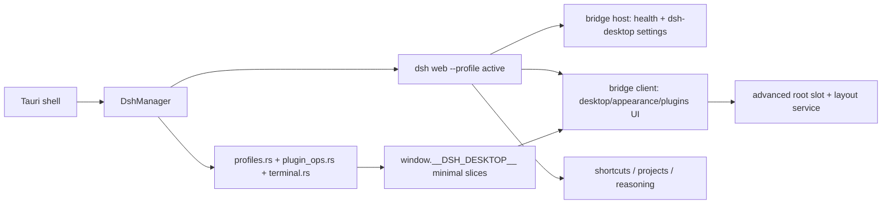

# 插件能力重构实施计划（对齐 deepseek-harness-desktop）

> **For agentic workers:** REQUIRED SUB-SKILL: Use superpowers:subagent-driven-development (recommended) or superpowers:executing-plans to implement this plan task-by-task. Steps use checkbox (`- [ ]`) syntax for tracking.

**Goal:** 以 `anywhere-labs/deepseek-harness-desktop` 的桌面插件能力与高级插件 UI 为参考，把本仓库 `packages/plugins` 从“bridge 大插件 + 零散功能插件”重构为“壳能力分层 + profile/插件管理 + 可切换桌面 UI”的插件体系，同时保持 Tauri 壳作为原生状态唯一来源。

**Architecture:** 保留 Tauri + dsh 双层架构，不迁移 Electron。Tauri Rust 继续拥有进程、窗口、托盘、配置、更新、快捷键等原生能力；dsh 插件只负责 dsh 内的服务、设置页与渲染面。参考仓库的 profile 状态机、受管插件操作、模式设置和 advanced root-slot UI 会按 Tauri 边界重新落地：profile 切换与插件命令由 Rust 提供桥接切片，advanced UI 由 bridge client 在 dsh 内以官方 slot 注册。

**Tech Stack:** Tauri 2.11 / Rust 2021、dsh cordis `0.1.0-rc.6`、`@deepseek-ai/dsh-client-ui-slots`、React 18、TypeScript strict、`@deepseek-ai/dsh-settings`、`schemastery`、node:test、cargo test。

---

## 1. 范围判断

本计划对齐参考仓库中可直接借鉴的部分：

- `desktop-shell` 的 compatibility / advanced 模式边界
- `desktop-profiles` 的 profile 发现、pending、last-known-good、失败回滚状态机
- `desktop-pnpm` 的“一次只跑一个受管插件操作”语义
- advanced 模式的 `root` slot、`layout` service、官方 sidebar/conversation/details 保留
- 原生能力只从插件最小桥接面暴露，不把 renderer 变成全量 Electron/Tauri API

本计划不复制参考仓库的 Electron bootstrap、内置 pnpm、Electron terminal shim、移动端/Channels/插件市场等超出当前项目目标的部分。

## 2. 参考能力与当前现状对照

| 参考能力 | 当前项目状态 | 重构目标 |
| --- | --- | --- |
| `dsh-desktop.mode` settings namespace | 无；Tauri 固定无边框窗口 | 新增 `compatibility` / `advanced` 模式，Rust 启动时读取并传给 dsh URL |
| `desktopProfiles`：发现、选择、last-known-good、回滚 | 无；`dsh web` 固定 profile，Rust 不传 `--profile` | Rust `profiles.rs` 状态机 + bridge `get_profiles` / `select_profile` |
| `desktopPnpm`：受管 add/remove/update | 无；只提供 `install_dsh` 全局安装 | Rust `plugin_ops.rs` 运行 `dsh plugin --profile <active>`，bridge 提供插件管理 UI |
| `desktop-terminal` | 无 | 可选实现 Rust `open_dsh_terminal`，桌面设置页提供入口 |
| `desktop-updates` | 已有 Rust `check_update` / `install_update` + 桌面页工具 | 保留，不迁移到 dsh host |
| advanced root-slot UI | `desktop-shell.ts` 用 DOM heuristics 找顶部栏、注入窗口控制 | 按官方 `root` slot 重构，advanced 模式提供 `AdvancedFrame` + `layout` service |
| theme presenter | 已有 `theme-apply.ts` 直接写 CSS 变量 | advanced 模式补充上游 `ThemeSnapshot` presenter，保留现有外观设置页 |
| 设置持久化 | shortcuts 使用 localStorage，projects 使用 HTTP 端点 | shortcuts 迁移到 dsh settings；projects 端点增加 token 校验并纳入 lifecycle |

## 3. 目标架构



### 能力归属

| 能力 | 归属 | 实现 |
| --- | --- | --- |
| profile 发现与切换 | Tauri 壳域 | Rust `profiles.rs` + bridge 命令 |
| dsh 插件 add/remove/update | Tauri 壳域 | Rust `plugin_ops.rs` 调 `dsh plugin --profile <name>` |
| mode 设置 | dsh 插件域 + Tauri 启动读取 | bridge host 注册 `dsh-desktop` settings；Rust 启动读取同一文件 |
| advanced UI | dsh 插件域 | bridge client `root` slot + `layout` service |
| 桌面/外观/插件管理 UI | dsh 插件域 | bridge client 设置节 |
| shortcuts / projects / reasoning | dsh 插件域 | 各自插件，短键改为 dsh settings，projects 加固 |
| 更新、托盘、通知、深链、文件拖放 | Tauri 壳域 | 保持现有 Rust 实现，不重复到 dsh host |

## 4. 文件结构

```text
packages/contracts/src/index.ts                       # 新增 profile / plugin op 契约
apps/shell/src-tauri/src/profiles.rs                  # 新增：profile 状态机与发现
apps/shell/src-tauri/src/plugin_ops.rs                # 新增：受管插件操作
apps/shell/src-tauri/src/mode.rs                      # 新增：dsh-desktop.mode 读取
apps/shell/src-tauri/src/terminal.rs                  # 新增：打开 dsh terminal（可选）
apps/shell/src-tauri/src/lib.rs                       # 修改：启动命令、桥接脚本、IPC
apps/shell/src-tauri/build.rs                         # 修改：注册新命令
apps/shell/src-tauri/capabilities/bridge.json         # 修改：最小切片
apps/shell/src-tauri/tauri.conf.json                  # 修改：CSP
packages/plugins/bridge/src/index.ts                  # 修改：注册 dsh-desktop settings
packages/plugins/bridge/src/client.tsx                # 修改：mode 分发
packages/plugins/bridge/src/client/desktop-shell.ts   # 修改：compat/advanced 分流
packages/plugins/bridge/src/client/advanced/          # 新增：AdvancedFrame / layout / presenter
packages/plugins/bridge/src/client/DesktopPanel.tsx   # 修改：profile / plugin / terminal
packages/plugins/bridge/src/client/PluginPanel.tsx    # 新增：插件管理 UI
packages/plugins/bridge/src/client/runtime.ts         # 修改：新增桥接类型
packages/plugins/shortcuts/src/index.ts               # 修改：注册 dsh settings
packages/plugins/shortcuts/src/client.tsx             # 修改：使用 settingsScope
packages/plugins/projects/src/index.ts                # 修改：disposer + token
packages/plugins/bridge/AGENTS.md                     # 修改：契约表
packages/plugins/AGENTS.md                            # 修改：插件清单与边界
apps/shell/src-tauri/AGENTS.md                        # 修改：IPC 表
docs/plugin-tauri-boundary.md                         # 修改：新能力边界
```

## 5. 插件包职责重构

| 当前包 | 当前职责 | 重构后职责 |
| --- | --- | --- |
| `bridge/` | 桥接对象、健康端点、桌面/外观 UI、DOM 标题栏 | 核心桌面插件：桥接对象、健康端点、`dsh-desktop.mode`、compat/advanced 分流、advanced root-slot UI、桌面/外观/插件管理 UI |
| `shortcuts/` | 快捷键设置 UI + localStorage | 快捷键设置 UI + dsh settings 持久化 + 双击 Esc + preset 动作 |
| `projects/` | workspace/session 端点，菜单由 Rust 注入 | host-only 端点 + lifecycle disposer + host token 校验，菜单继续由 Rust 注入 |
| `reasoning/` | 模型设置 UI + `llm.resolveModelInfo` 包装 | 保持职责，包装改为可清理、HMR 安全 |
| `client-kit/` | 共享注入/CSS/构建 helper | 不变，不进入插件 resources |

重构不新增独立包，避免插件装配层过度碎片化；profile 与插件管理以 bridge 的能力切片 + Rust 状态机落地，作为后续新增 `desktop-profiles` / `desktop-pnpm` 独立 host 包的前置契约。

## 6. 实施阶段

### M0: 契约与安全基线

#### Task 0.1: 扩展共享契约与命令注册

**Files:**
- Modify: `packages/contracts/src/index.ts`
- Modify: `apps/shell/src-tauri/build.rs`
- Modify: `apps/shell/src-tauri/capabilities/default.json`
- Modify: `apps/shell/src-tauri/capabilities/bridge.json`
- Modify: `packages/plugins/bridge/src/client/runtime.ts`
- Modify: `packages/plugins/bridge/src/index.ts`

- [ ] **Step 1: 新增类型**

```ts
export type DesktopMode = "compatibility" | "advanced";

export interface DshProfileSummary {
  name: string;
  dir: string;
  exists: boolean;
  web_capable: boolean;
  problem: string | null;
}

export interface DesktopProfileState {
  version: 1;
  active: string;
  pending: string | null;
  last_known_good: string;
}

export interface ProfileSelectionResult {
  profile: string;
  restart_required: boolean;
}

export interface PluginOperationResult {
  ok: boolean;
  exit_code: number | null;
  output: string[];
}
```

- [ ] **Step 2: 注册命令**

在 `COMMANDS` 中加入：

```ts
getProfiles: "get_profiles",
selectProfile: "select_profile",
getActiveProfile: "get_active_profile",
installProfilePlugin: "install_profile_plugin",
removeProfilePlugin: "remove_profile_plugin",
updateProfilePlugins: "update_profile_plugins",
```

`apps/shell/src-tauri/build.rs` 的 `AppManifest::commands` 同步追加上述命令；`capabilities/default.json` 追加 `allow-*`，`capabilities/bridge.json` 只追加 bridge client 实际使用的命令，不把终端或更新类命令无条件开放。

- [ ] **Step 3: 同步桥接类型**

`packages/plugins/bridge/src/client/runtime.ts` 增加 `BridgeLike.profiles`、`BridgeLike.plugins` 的最小切片；终端能力只在 Task 2.3 实现后追加；`packages/plugins/bridge/src/index.ts` 的 `DshDesktopBridge` 同步。

- [ ] **Step 4: 验证**

Run: `yarn typecheck`
Expected: 全 workspace 类型检查通过；Rust 侧只需完成命令注册，M1/M2 再按任务补齐具体实现。

#### Task 0.2: 收紧远端桥接安全基线

**Files:**
- Modify: `apps/shell/src-tauri/tauri.conf.json`
- Modify: `apps/shell/src-tauri/src/inject.rs`
- Modify: `apps/shell/src-tauri/capabilities/bridge.json`
- Modify: `apps/shell/src-tauri/capabilities/shortcuts.json`

- [ ] **Step 1: 设置 CSP**

在 `apps/shell/src-tauri/tauri.conf.json` 增加最小 CSP，至少覆盖 `default-src 'self' http://127.0.0.1:*; connect-src 'self' http://127.0.0.1:*; script-src 'self' http://127.0.0.1:*; style-src 'self' 'unsafe-inline' http://127.0.0.1:*`。随后用 `cargo test` 和一次 `yarn dev` 验证 dsh web 不因 CSP 阻断。

- [ ] **Step 2: 校验当前托管 origin**

`inject.rs` 的注入判定从“任意 loopback”改为“仅当前 `DshManager` 托管 URL 的 origin”，并保留一次性随机 token 校验；没有托管 URL 时禁止注入。

- [ ] **Step 3: 拆分 remote capability**

`bridge.json` 只保留 `get_status`、`get_config`、`set_config`、`window_action`、`open_external`、`get_autostart`、`set_autostart`、`get_desktop_settings`、`set_desktop_settings`、`check_update`、`install_update`、`get_profiles`、`select_profile`、`get_active_profile`、`install_profile_plugin`、`remove_profile_plugin`、`update_profile_plugins`。项目命令和终端命令不放进 bridge remote；`shortcuts.json` 维持快捷键独立切片。

- [ ] **Step 4: 验证**

Run: `yarn typecheck && cargo test`
Expected: 类型与 Rust 单测通过；`bridge.json` 不再包含 `allow-get-projects` 等未消费命令。

### M1: Profile 状态机与启动切换

#### Task 1.1: 实现 Rust profile 发现与状态机

**Files:**
- Create: `apps/shell/src-tauri/src/profiles.rs`
- Modify: `apps/shell/src-tauri/src/lib.rs`

- [ ] **Step 1: 实现发现**

`list_profiles(home)` 遍历 `$DSH_HOME/profiles/*/package.json`，解析 `dsh.profile.bundles`，要求 `@deepseek-ai/dsh-base` 出现于 `@deepseek-ai/dsh-web-app` 之前，返回 `DshProfileSummary`。对非法 manifest 返回 `problem` 而不是抛错。

- [ ] **Step 2: 实现状态机**

在应用数据目录使用 `profile-state.json`，字段与 `DesktopProfileState` 一致。复制参考 `profile-manager.ts` 的语义：

- 启动时读 `active` / `pending` / `last_known_good`，不合法回退 `web`
- `select_profile(name)` 只持久化 `pending`，不就地重启
- 启动成功且健康检查通过后调用 `mark_healthy(active)` 提交 `last_known_good`
- 启动失败回滚到 `last_known_good`

文件写入使用临时文件 + rename，模式 `0o600`。

- [ ] **Step 3: 单元测试**

在 `profiles.rs` 内增加 `#[cfg(test)]`，覆盖：`list_profiles` 过滤非法 profile、pending 回滚、mark_healthy、状态文件损坏恢复。

Run: `cargo test profiles`
Expected: 新增测试全部通过。

#### Task 1.2: `dsh web` 改为带 profile 启动

**Files:**
- Modify: `apps/shell/src-tauri/src/lib.rs`

- [ ] **Step 1: 读取 active profile**

`DshManager::start` 在 `prepare_overlay` 前读取 `profiles::begin_startup`，得到 active profile，并保存该次 startup 上下文。

- [ ] **Step 2: 修改启动参数**

把当前参数从：

```text
dsh web --patch <overlay> --host 127.0.0.1 --port 0
```

改为：

```text
dsh --profile <active> --patch <overlay> --host 127.0.0.1 --port 0
```

同时设置环境变量：

```text
DSH_DESKTOP_PROFILE=<active>
DSH_DESKTOP_PROFILE_DIR=<active profile dir>
DSH_DESKTOP_STATE_DIR=<app_data_dir>
```

- [ ] **Step 3: 健康检查后提交 healthy**

`Ready{generation,url}` 成功处理后调用 `mark_healthy(active)`；`ReadinessError` / 非预期退出时保留旧状态，供回滚逻辑使用。

- [ ] **Step 4: 验证**

Run: `cargo test`
Expected: 现有 49 个测试继续通过；`dsh --profile web --help` 的启动路径在手动 `yarn dev` 下可正常拉起。

#### Task 1.3: bridge profile 命令与 UI

**Files:**
- Modify: `apps/shell/src-tauri/src/lib.rs`
- Modify: `packages/contracts/src/index.ts`
- Modify: `packages/plugins/bridge/src/client/DesktopPanel.tsx`
- Modify: `packages/plugins/bridge/src/client/runtime.ts`
- Modify: `packages/plugins/bridge/src/index.ts`

- [ ] **Step 1: Rust 命令**

实现 `get_profiles`、`get_active_profile`、`select_profile(name)`。`select_profile` 校验 `name` 属于 `list_profiles` 且 `web_capable`，写 pending 后返回 `ProfileSelectionResult`。

- [ ] **Step 2: bridge 暴露**

`BRIDGE_SCRIPT` 增加：

```js
profiles: {
  list: function () { return invoke("get_profiles"); },
  active: function () { return invoke("get_active_profile"); },
  select: function (name) { return invoke("select_profile", { name: name }); },
},
```

`capabilities/bridge.json` 增加 `allow-get-profiles`、`allow-get-active-profile`、`allow-select-profile`。

- [ ] **Step 3: DesktopPanel 增加“运行环境”节**

在 `DesktopPanel.tsx` 增加 profile 下拉：调用 `profiles.list()` 渲染可选项，不可选项目禁用并显示 `problem`；选择后调用 `profiles.select(name)`，再显示“重启 dsh 后切换”提示并调用 `bridge.restart()`。

- [ ] **Step 4: 验证**

Run: `yarn typecheck && yarn build:plugins`
Expected: 插件可构建；`resources/plugins/bridge/` 中 client bundle 包含 `profiles` 桥接切片。

### M2: 受管插件管理能力

#### Task 2.1: 实现 Rust plugin operation runner

**Files:**
- Create: `apps/shell/src-tauri/src/plugin_ops.rs`
- Modify: `apps/shell/src-tauri/src/lib.rs`

- [ ] **Step 1: 定义 operation**

`PluginOps` 保存当前唯一 operation：`Option<(String, Child)>`。新操作进行中直接返回 busy 错误；`cancel_current` 在重启/停止时调用。

- [ ] **Step 2: 执行命令**

`install_profile_plugin(profile, spec)` 运行：

```text
<node> <dsh> plugin --profile <profile> add <spec>
```

`remove_profile_plugin(profile, name)` 运行 `remove <name>`；`update_profile_plugins(profile)` 运行 `update`。工作目录使用 active profile 目录，环境变量复用 `effective_path()`、`DSH_HOME`、`DSH_DESKTOP_MANAGED`，stdout/stderr 写入 dsh 日志并追加到 `PluginOperationResult.output`。

- [ ] **Step 3: 校验**

`spec` 和 `name` 非空、不含 NUL、长度不超过 512；不通过 shell 解释 argv。安装前由 UI 明确展示用户输入，Rust 只做参数边界校验，不承诺 npm 包内容安全。

- [ ] **Step 4: 单测**

在 `plugin_ops.rs` 增加测试，使用 `node -e` 代替真实 dsh 验证 argv、cwd、env 与退出码解析。

Run: `cargo test plugin_ops`
Expected: 参数构造与退出码测试通过。

#### Task 2.2: bridge 插件命令与 UI

**Files:**
- Modify: `apps/shell/src-tauri/src/lib.rs`
- Modify: `packages/contracts/src/index.ts`
- Modify: `packages/plugins/bridge/src/index.ts`
- Modify: `packages/plugins/bridge/src/client/runtime.ts`
- Create: `packages/plugins/bridge/src/client/PluginPanel.tsx`
- Modify: `packages/plugins/bridge/src/client.tsx`

- [ ] **Step 1: bridge 暴露**

`BRIDGE_SCRIPT` 增加：

```js
plugins: {
  install: function (spec) { return invoke("install_profile_plugin", { profile: null, spec: spec }); },
  remove: function (name) { return invoke("remove_profile_plugin", { profile: null, name: name }); },
  update: function () { return invoke("update_profile_plugins", { profile: null }); },
},
```

`profile: null` 表示 Rust 自动使用 active profile；远程 capability 不接收任意 profile 参数。

- [ ] **Step 2: 新增设置节**

在 `client.tsx` 注册 `settings.section` id `plugins`，渲染 `PluginPanel.tsx`。UI 包含：当前 active profile 展示、包名输入、安装按钮、已安装插件列表、移除按钮、更新按钮、操作输出区、忙碌状态和“操作成功后重启 dsh”按钮。

- [ ] **Step 3: 文案**

中文文案覆盖：`插件管理`、`安装插件`、`移除`、`更新全部`、`操作中`、`安装成功，重启后生效`、`操作失败`、`当前只有一个插件操作可运行`。

- [ ] **Step 4: 验证**

Run: `yarn typecheck && yarn build:plugins && node --test scripts/build-plugins.test.mjs`
Expected: 类型检查、插件构建、构建脚本测试全部通过。

#### Task 2.3: 打开 DSH 终端（可选）

**Files:**
- Create: `apps/shell/src-tauri/src/terminal.rs`
- Modify: `apps/shell/src-tauri/src/lib.rs`
- Modify: `packages/contracts/src/index.ts`
- Modify: `packages/plugins/bridge/src/index.ts`
- Modify: `packages/plugins/bridge/src/client/runtime.ts`
- Modify: `packages/plugins/bridge/src/client/DesktopPanel.tsx`

仅当产品确认需要“打开 DSH 终端”时执行本任务，未执行时不要注册 `open_dsh_terminal` 命令。

- [ ] **Step 1: 实现 Rust 命令**

`open_dsh_terminal(profile)` 校验 active profile 目录后：macOS 用 `open -a Terminal <dir>`，Windows 优先 `wt -d <dir>` 并回退 `cmd /c start`，Linux 返回不支持错误。命令只接受 active profile，不接受任意路径。

- [ ] **Step 2: bridge 暴露**

在 `BRIDGE_SCRIPT` 增加 `terminal.open()`，`capabilities/bridge.json` 增加 `allow-open-dsh-terminal`；若本任务未执行，M0 契约中不出现该命令。

- [ ] **Step 3: DesktopPanel 增加工具入口**

在“工具”区增加“打开 DSH 终端”，点击后显示当前 profile 路径并调用 `bridge.terminal.open()`，失败时展示原生错误文案。

- [ ] **Step 4: 验证**

Run: `yarn typecheck && cargo test`
Expected: `open_dsh_terminal` 命令、桥接切片与平台命令测试通过。

### M3: 模式设置与 Advanced Shell UI

#### Task 3.1: bridge host 注册 `dsh-desktop` settings

**Files:**
- Modify: `packages/plugins/bridge/src/index.ts`
- Modify: `packages/plugins/bridge/package.json`（如缺少 `@deepseek-ai/dsh-settings` / `schemastery` peer）

- [ ] **Step 1: 注册命名空间**

在 bridge host `apply` 中注册：

```ts
const DESKTOP_NS = settingsNamespace("dsh-desktop");
ctx.settings.register(DESKTOP_NS, z.object({
  mode: z.union(["compatibility", "advanced"] as const).default("compatibility"),
}), { applies: "restart" });
```

不注册 `ui-theme`，仍只 bind 上游命名空间。

- [ ] **Step 2: 客户端绑定**

bridge client 用 `settingsScope.bind` 读写 `dsh-desktop.mode`，在 DesktopPanel 的“运行环境”节显示“兼容模式 / 高级模式”。保存后提示重启 dsh。

- [ ] **Step 3: 验证**

Run: `yarn typecheck && yarn build:plugins`
Expected: `settingsNamespace` 与 schema 校验通过。

#### Task 3.2: Rust 读取 mode 并传入 renderer

**Files:**
- Create: `apps/shell/src-tauri/src/mode.rs`
- Modify: `apps/shell/src-tauri/src/lib.rs`

- [ ] **Step 1: 读取 mode**

`read_desktop_mode(home)` 读取 `$DSH_HOME/settings.yaml` 的 `dsh-desktop.mode`，非法值回退 `compatibility`；Linux 强制 `compatibility`。

- [ ] **Step 2: 启动时注入环境与 URL**

启动子进程时设置 `DSH_DESKTOP_MODE`；`open_window` 导航前把 URL 追加：

```text
?dsh-desktop-mode=<mode>&dsh-desktop-platform=<darwin|win32|linux>
```

- [ ] **Step 3: 验证**

Run: `cargo test mode`
Expected: mode 解析与平台默认测试通过。

#### Task 3.3: 移植 advanced root-slot UI

**Files:**
- Create: `packages/plugins/bridge/src/client/advanced/AdvancedFrame.tsx`
- Create: `packages/plugins/bridge/src/client/advanced/layout-state.ts`
- Create: `packages/plugins/bridge/src/client/advanced/layout-service.ts`
- Create: `packages/plugins/bridge/src/client/advanced/theme-presenter.ts`
- Create: `packages/plugins/bridge/src/client/advanced/advanced.module.css`
- Modify: `packages/plugins/bridge/src/client/desktop-shell.ts`
- Modify: `packages/plugins/bridge/src/client.tsx`

- [ ] **Step 1: 移植布局状态与组件**

从参考仓库复制并改写 `layout-state.ts`、`layout-service.ts`、`AdvancedFrame.tsx` 的 slot 声明：

```ts
declare module '@deepseek-ai/dsh-client-ui-slots' {
  interface SlotMap {
    'sidebar': { kind: 'single'; scope: 'root'; owner: DesktopSidebarOwnerProps }
    'conversation': { kind: 'single'; scope: 'session-maybe'; owner: Record<never, never> }
    'details': { kind: 'single'; scope: 'session'; owner: Record<never, never> }
    'shell.overlay': { kind: 'list'; scope: 'root' }
  }
}
```

组件只保留三栏几何、resize handle 与 overlay，不重写官方 sidebar/conversation/details。

- [ ] **Step 2: 模式分发**

`desktop-shell.ts` 增加 `applyDesktopShell(mode, platform)`：

- `compatibility`：保留现有 DOM chrome、窗口控制与主题应用
- `advanced`：调用 `applyAdvancedShell`，注册 `ctx.layout` 和 `root` slot，不执行 `findTopBar` / 注入 controls

`client.tsx` 从 `window.location.search` 读取 `dsh-desktop-mode` / `dsh-desktop-platform`，缺失或非法时按 compatibility 处理。

- [ ] **Step 3: theme presenter**

`theme-presenter.ts` 订阅 `ctx.theme.getTheme()` / `theme/change`，把上游 `ThemeSnapshot` 的 `colorScheme`、dark marker、token 与 `theme-color` 投影到 document；dispose 时只清理本插件写入的属性。

- [ ] **Step 4: 布局测试**

在 `packages/plugins/bridge/tests/advanced-layout.test.mjs` 中测试 `computeDesktopColumns`：sidebar 收起、details 超过视口、窄屏自动收起。

Run: `yarn test --workspace @dsh-desktop/plugin-bridge`
Expected: 布局测试通过。

#### Task 3.4: Tauri 窗口差异（可选）

**Files:**
- Modify: `apps/shell/src-tauri/src/lib.rs`

- [ ] **Step 1: 确认模式与窗口外观**

本计划建议第一阶段保持现有无边框窗口在两种模式一致，只在 dsh renderer 内切换 UI；后续如需参考仓库的“兼容模式原生边框”，单独在 `create_main_window` 按 mode 调用 `set_decorations` 并补齐启动页标题栏回归测试。此项不阻塞 M3 验收。

### M4: 功能插件重构

#### Task 4.1: shortcuts 改用 dsh settings

**Files:**
- Modify: `packages/plugins/shortcuts/src/index.ts`
- Modify: `packages/plugins/shortcuts/src/client.tsx`
- Modify: `packages/plugins/shortcuts/package.json`
- Modify: `packages/plugins/shortcuts/AGENTS.md`

- [ ] **Step 1: host 注册设置**

在 `src/index.ts` 注册 `dsh-desktop.shortcuts` settings，schema 包含 `doubleEscapeStopEnabled`、`doubleEscapeStopTimeoutMs`、`presets`。schema 默认值与现有 `normalizeShortcutsSettings` 一致。

- [ ] **Step 2: client 替换 localStorage**

`client.tsx` 删除 `localStorage` scope，改用 `ctx.settingsScope.bind`；现有本地数据只在首次装载时做一次性迁移：读取旧 key，写入 settings，再删除旧 key。

- [ ] **Step 3: 验证**

Run: `yarn typecheck && yarn build:plugins`
Expected: shortcuts 不再写 localStorage；HMR 后设置仍保留。

#### Task 4.2: projects 端点加固

**Files:**
- Modify: `packages/plugins/projects/src/index.ts`
- Modify: `packages/plugins/projects/AGENTS.md`

- [ ] **Step 1: lifecycle**

把两个 `webServer.register` 返回的 disposer 收集进 `sctx.effect` disposer，卸载时全部执行。

- [ ] **Step 2: token 校验**

Rust 在 dsh 子进程设置 `DSH_DESKTOP_HOST_TOKEN`；projects host 读取该环境变量，端点校验 `x-dsh-desktop-token`。`HARNESS_CHROME_SCRIPT` 注入时携带该 token；缺失或错误的请求返回 403。

- [ ] **Step 3: 验证**

Run: `yarn typecheck && node --test scripts/build-plugins.test.mjs`
Expected: 构建脚本测试通过；`projects` 端点不再信任任意 loopback origin。

#### Task 4.3: reasoning host 包装清理

**Files:**
- Modify: `packages/plugins/reasoning/src/index.ts`
- Modify: `packages/plugins/reasoning/AGENTS.md`

- [ ] **Step 1: 保留可清理包装**

维持当前“保存 original 并在 effect disposer 中恢复”的实现，增加单测或 smoke：HMR 触发两次 apply 后 `ctx.llm.resolveModelInfo` 仍指向原函数且只包装一次。

- [ ] **Step 2: 验证**

Run: `yarn typecheck && yarn build:plugins`
Expected: reasoning 插件可构建，host 包装无重复叠加。

#### Task 4.4: 文档同步

**Files:**
- Modify: `packages/plugins/AGENTS.md`
- Modify: `packages/plugins/bridge/AGENTS.md`
- Modify: `apps/shell/src-tauri/AGENTS.md`
- Modify: `docs/plugin-tauri-boundary.md`
- Modify: `README.md`

- [ ] **Step 1: 更新插件清单**

`packages/plugins/AGENTS.md` 加入新能力：bridge 的 mode/profile/plugin UI、shortcuts 的 dsh settings 持久化、projects 的 token 校验。

- [ ] **Step 2: 更新契约表**

根 AGENTS、`apps/shell/src-tauri/AGENTS.md`、`packages/plugins/bridge/AGENTS.md` 同步新增命令、事件、bridge 成员与 capabilities 文件。

### M5: 全量验证

#### Task 5.1: 自动化验证

- [ ] **Step 1: 前端与插件**

Run: `yarn typecheck && yarn lint && yarn format:check`
Expected: 全绿。

Run: `yarn build:plugins && node --test scripts/build-plugins.test.mjs && node --test scripts/lan-proxy.test.mjs`
Expected: 插件构建与脚本测试通过。

- [ ] **Step 2: Rust**

Run: `cargo fmt --check && cargo clippy && cargo test`
Expected: Rust 无告警，全部测试通过。

#### Task 5.2: 手动验证

- [ ] **Step 1: profile 切换**

`yarn dev` 启动后，在“桌面 → 运行环境”选择另一个 web-capable profile，确认状态机写入 pending、重启、健康检查后提交 last-known-good；手工制造非法 profile 确认回滚。

- [ ] **Step 2: 插件管理**

安装一个测试插件，确认 `dsh plugin --profile <active> add` 输出进入日志；成功后重启 dsh，插件出现在 dsh 设置页。

- [ ] **Step 3: advanced UI**

切换到高级模式并重启；确认 advanced root-slot 三栏布局、sidebar 折叠、details 开关、窗口拖动与 resize 可用；Linux 保持 compatibility。

- [ ] **Step 4: 回归**

确认现有桌面页、外观页、shortcuts、模型页、projects 右键菜单、深链、更新和托盘功能不回退。

## 7. 执行顺序建议

1. 先完成 M0 安全与契约，避免新远程能力在旧边界上累积。
2. 再完成 M1 profile 和 M2 插件管理，因为它们都只增加 Tauri 桥接命令，不改变 renderer 根结构。
3. M3 advanced UI 单独验证，风险最高；如果 slot 注册或 HMR 异常，可以先只发布 compatibility 模式。
4. M4 是既有插件清理，M5 是最终 gate。

## 8. 不做项

- 不迁移 Electron 内置 pnpm / Node runtime；Tauri 仍使用 `DSH_BIN` / `DSH_NODE` / PATH 解析结果。
- 不把更新、托盘、通知、深链迁移进 dsh host。
- 不实现移动端、Channels、插件市场；只提供受管 add/remove/update 的最小 UI。
- 不在 renderer 暴露 `core:window` 或任意 shell 权限；所有桥接仍是最小命令切片。
